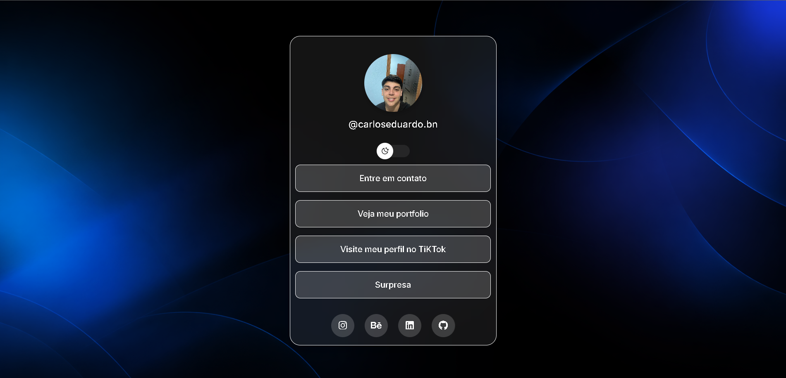

# 🔗 Link Hub

🔗 [Acessar Projeto](https://linksdev-woad.vercel.app/)

---

## 🖼️ Preview

---

## 📌 Sobre o Projeto

Aplicação web desenvolvida com o objetivo de centralizar e organizar múltiplos links em uma única interface, facilitando o acesso a diferentes plataformas e conteúdos pessoais, semelhante a um agregador de links.

---

## 🎨 Design e Experiência

O layout foi desenvolvido com foco em simplicidade e usabilidade, apresentando uma interface limpa e direta. A organização dos elementos permite acesso rápido aos links, proporcionando uma experiência intuitiva ao usuário.

---

## 🛠️ Tecnologias Utilizadas

- HTML5  
- CSS3  
- JavaScript  

---

## 🚀 Funcionalidades

- Centralização de múltiplos links em um único lugar  
- Interface objetiva  
- Navegação rápida e intuitiva  
- Alternância entre tema claro e escuro  
- Layout responsivo  

---

## 📱 Responsividade

A aplicação foi desenvolvida com abordagem responsiva, garantindo uma boa experiência em dispositivos móveis, tablets e desktops.
